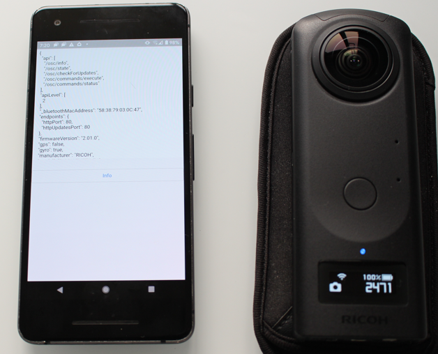

# Oppkey THETA ATK Base Template

Oppkey's starter Flutter template for building RICOH THETA mobile and desktop
applications to test the WebAPI.

## Getting Started

This project is a starting point for a Flutter application to test the
RICOH THETA 360 camera API.

A few resources to get you started if this is your first
Oppkey THETA ATK project:

* [Oppkey THETA ATK v0.3 video tutorials](https://youtube.com/playlist?list=PL0feeJIlTI8k8mQzAn8cu-8xRtf1vwPlu)
* [Oppkey THETA ATK Site](https://oppkey.github.io/oppkey_theta_atk/)

## Additional Documentation

* [oppkey_thetaf Flutter widgets API documentation](https://oppkey.github.io/oppkey_thetaf/)

## Help

* [forum](https://community.theta360.guide)
